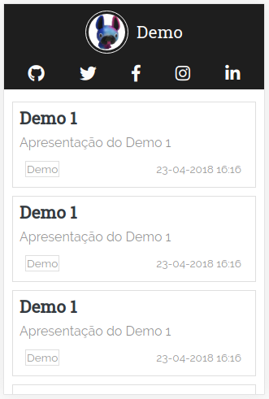
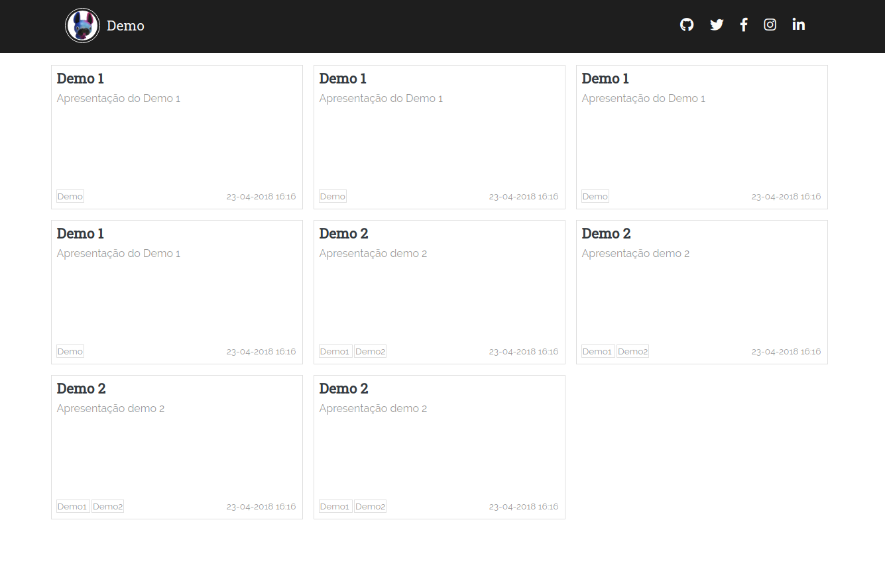

# Minimalist

*Minimalist* é um tema minimalista para o [Hugo](https://gohugo.io/)

<a href='https://ko-fi.com/G2G1S9O1' target='_blank'></a>

## Instalação

    $ mkdir themes
    $ cd themes
    $ git submodule add https://github.com/kelvinoenning/hugo-theme-minimalist.git hugo-theme-minimalist

Para mais informações acesse a [documentação Hugo](https://gohugo.io/themes/installing/).

## Imagem demo




## Exemplo de configuração para o blog

```yml
BaseURL: "http://example.org/"
LanguageCode: "pt-BR"
Title: "Demo"
Theme: "hugo-theme-minimalist"

Permalinks:
  Post: "/:year/:month/:title/"

Params:
  Meta:
    Description: "Minimalist - O melhor tema minimalista para o Hugo"
    keywords: "minimalist, tema, theme, hugo"
    Robots: "index, follow"
    Revisit-after: "1 day"
    Language: "Portuguese"
    Generator: "N/A"
  Profile:
    Img: "/img/profile.jpg"
    Title: "Demo"
  Links:
    - Name: "Github"
      Url: "https://github.com/..."
      Icon: "fa-github"
    - Name: "Twitter"
      Url: "https://twitter.com/..."
      Icon: "fa-twitter"
    - Name: "Facebook"
      Url: "https://www.facebook.com/..."
      Icon: "fa-facebook-f"
    - Name: "Instagram"
      Url: "https://www.instagram.com/..."
      Icon: "fa-instagram"
    - Name: "Linkedin"
      Url: "https://br.linkedin.com/in/..."
      Icon: "fa-linkedin-in"
```

## Exemplo de configuração para o post

```md
---
title:  "<title>"
description: "<description>"
date:   2018-04-01 07:30:00
tag: [tag1, tag2, tag3]
keywords: [metakey1, metakey2]
cover-image: "<cover-image-path>"
cover-width: 600
cover-height: 315
twitter-hashtag: "hashtag1, hashtag2"
---
```

## Tarefas, versões, correções, melhorias

[Aqui](https://github.com/kelvinoenning/hugo-theme-minimalist/issues/1).

### Principais melhorias para a V2.0
- Adicionar compartilhamento com **Facebook** e **Twitter**.
- Adicionar sistema para comentários com **disqus**.

## Licença

[MIT Licensed](https://github.com/kelvinoenning/hugo-theme-minimalist/blob/master/LICENSE).
